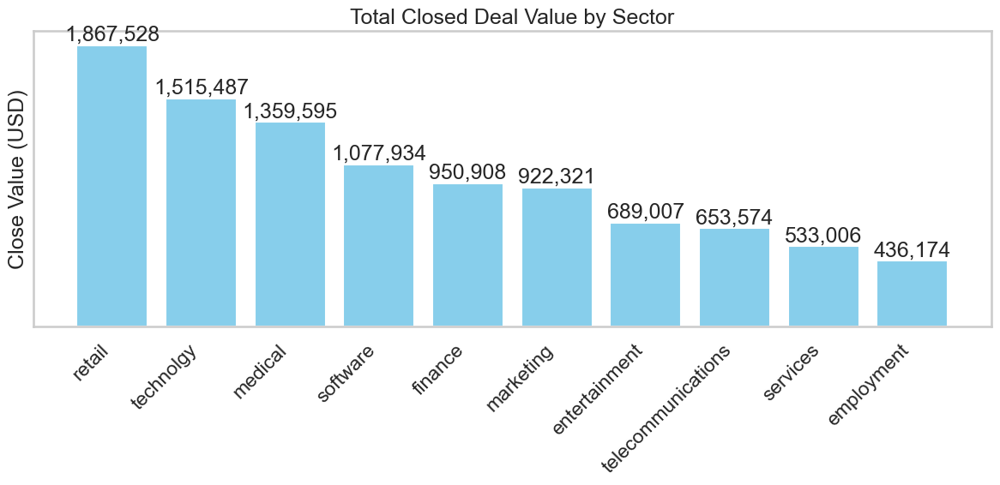
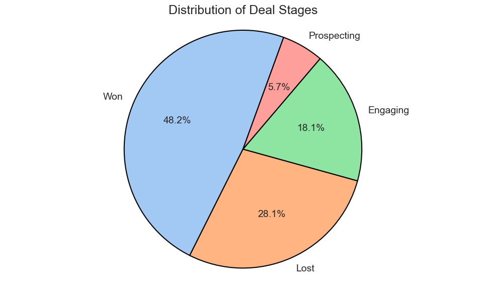
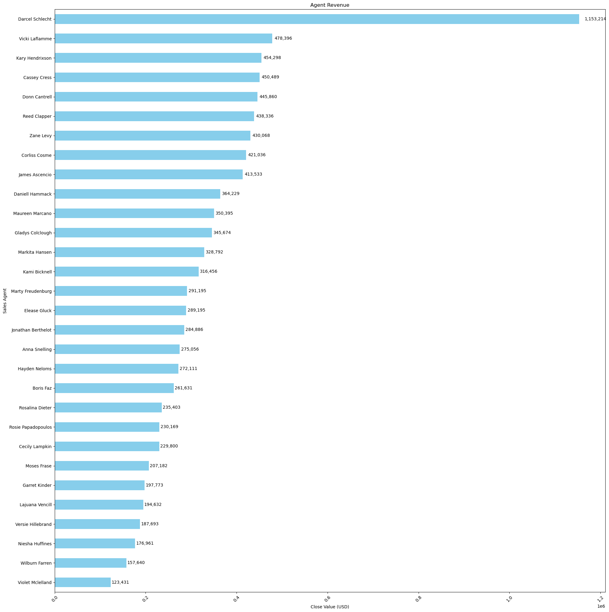
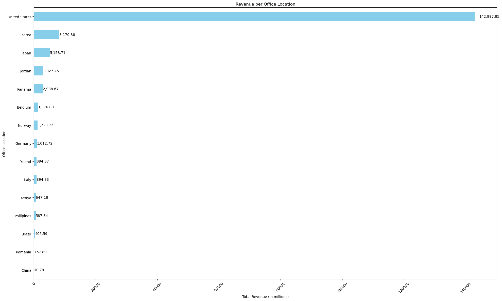
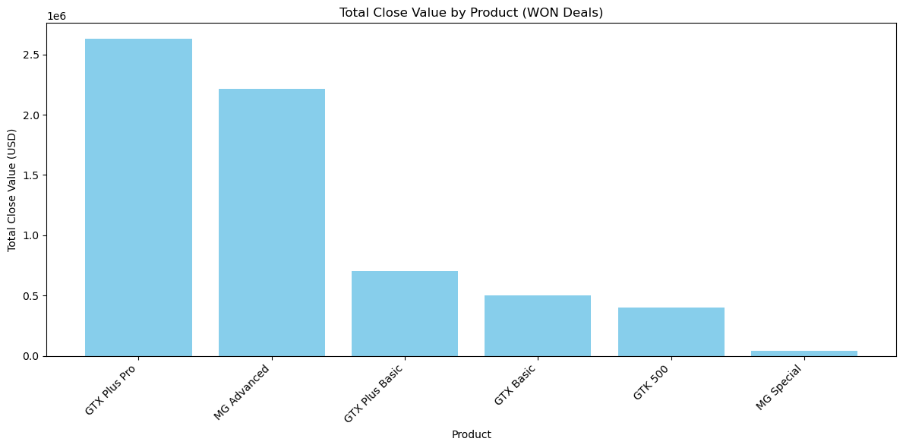
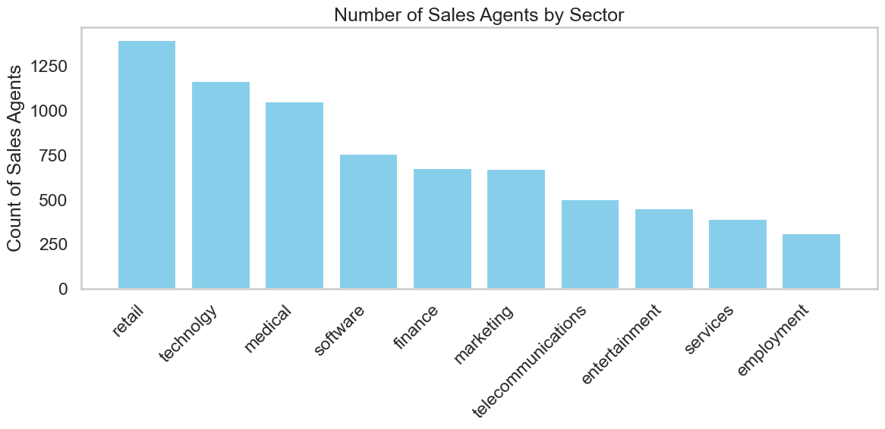

# CRM Sales Opportunities Analysis

This project analyzes data from the CRM (Customer Relationship Management) sector, focusing on sales opportunities. The analysis examines sales team performance, revenue potential versus conversion rates, and opportunity distribution by year using Pandas, Matplotlib and Seaborn for data visualization.

## Project Overview

This analysis provides insights into CRM sales efficiency, identifying key factors that impact sales performance and opportunity conversion. The project aims to optimize sales strategies and enhance decision-making processes.

## Key Objectives

-   Analyze sales team performance to identify trends and optimize opportunity management.
-   Assess opportunity conversion rates to ensure high-quality lead generation and closure.

## Expected Outcomes

-   Improved sales opportunity management strategies
-   Enhanced tracking of sales performance and conversion metrics
-   Increased sales operational efficiency
-   Data-driven decision-making capabilities

## Tables

---

For more details open [Analysis.ipynb](./Analysis.ipynb)
